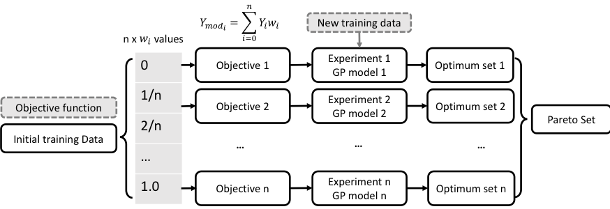

===================
Key Concepts in BO
===================

.. contents:: Table of Contents
    :depth: 2

What can BO do?
===============

Key Concepts and Terminology
============================

Surrogate module
----------------

Gaussian Process (GP)
---------------------
A GP model constructs a joint probability distribution over the variables, assuming a multivariate Gaussian distribution. 
A GP is determined from a mean function :math:`\\mu({\\bf X})` and a covariance kernel function :math:`\\Sigma({\\bf X}, {\\bf X^{'}})`. 
A Matern covariance function is typically used as the kernel function:

.. math::

    {C_{v}(d)=\sigma^{2} \frac{2^{1-\upsilon}}{\Gamma(\upsilon)} {(\sqrt{2} \upsilon \frac{d}{\rho})}^{\upsilon} K_{\upsilon} (\sqrt{2} \upsilon \frac{d}{\rho})}

where :math:`d` is the distance between two points, :math:`\\sigma` is the standard deviation, :math:`\\upsilon` and 
:math:`\\rho` are non-negative parameters, :math:`\\Gamma` represents the gamma function, and :math:`K_{\upsilon}` is 
the modified Bessel function. A typical BO procedure starts with finding the next sampling point by optimizing the acquisition 
function over the GP. Once a new observation is obtained from :math:`\\hat{f}`, it is added to the previous observations 
and the GP is updated.

Acquisition Functions
---------------------
The acquisition function is applied to obtain the new sampling point :math:`\\bf X_{new}`. It measures the value of evaluating 
the objective function at :math:`\\bf X_{new}`, based on the current posterior distribution over :math:`\\hat{f}`. The most 
commonly used acquisition function is expected improvement (EI). The EI is the expectation taken under the posterior 
distribution :math:`\\hat{f}` of the improvement of the new observation at :math:`\\bf X` over the current best 
observation :math:`f^{*}`:

.. math::

    EI({\bf X})=\mathbb{E}[max(\hat{f}({\bf X})-f^{*},0)]

Aside from the EI, there are also other acquisition functions for single objective BO available in NEXTorch, including 
probability of improvement (PI), upper confidence bound (UCB), and their Monte Carlo variants (qEI, qPI, qUCB).

Multi-objective Optimization (MOO)
----------------------------------
Multi-objective optimization involves more than one objective function that are to be minimized (maximized). The optimal 
is not a single point but a set of solutions that define the best tradeoff between competing objectives. This is common 
in engineering problems. For instance, an increase in selectivity of a product would lead to a decrease in the yield in 
a reaction. In the MOO, the goodness of a solution is determined by the dominance, where :math:`{\\bf X_{1}}` dominates 
:math:`{\\bf X_{2}}` when :math:`{\\bf X_{1}}`  is no worse than :math:`{\\bf X_{2}}`  in all objectives, and :math:`{\\bf X_{1}}` 
is strictly better than :math:`{\\bf X_{2}}` in at least one objective. A Pareto optimal set is the set where all the 
points of the set are not dominated by each other in that set, and the boundary defined by the response of this set is 
the Pareto front. 

One classic method to perform MOO is the weighted sum method, which scalarizes a set of objectives :math:`\\lbrace {\\bf Y_{1}},{\\bf Y_{2}},...{\\bf Y_{i}},...{\\bf Y_{M}}\\rbrace` 
into a new objective :math:`{\\bf Y_{mod}}` by multiplying each objective with a set of user-defined weights 
:math:`\\lbrace w_{1},w_{2},...w_{i},...w_{M}\\rbrace`, simplifying the MOO into a single-objective optimization, where 
:math:`{\\bf Y_{mod}}=\\Sigma w_{i} {\\bf Y_{i}}`. By obtaining the optimal for multiple sets of chosen weights, one can 
populate the Pareto optimal. This method is simple but sometimes difficult to select proper set of weights to obtain the 
optimal in a desired region of the design space.

An alternative is to use expected hypervolume improvement (EHVI) as the acquisition function. A hypervolume indicator (HV) 
is used to approximate the Pareto set and EHVI evaluates its EI. In NEXTorch, one can use either weighted sum method or 
Monte Carlo EHVI (qEHVI) as acquisition function to perform MOO.

